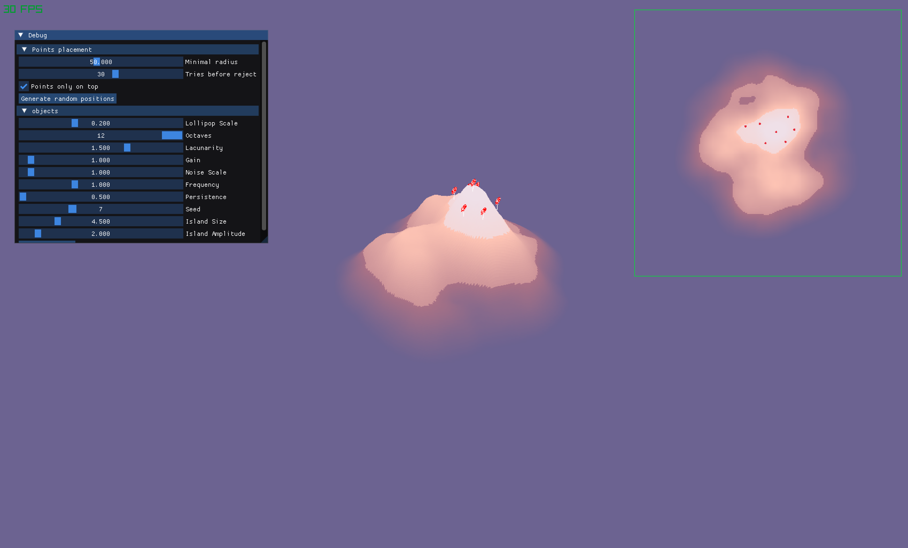
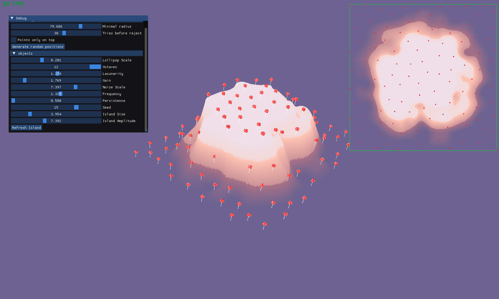
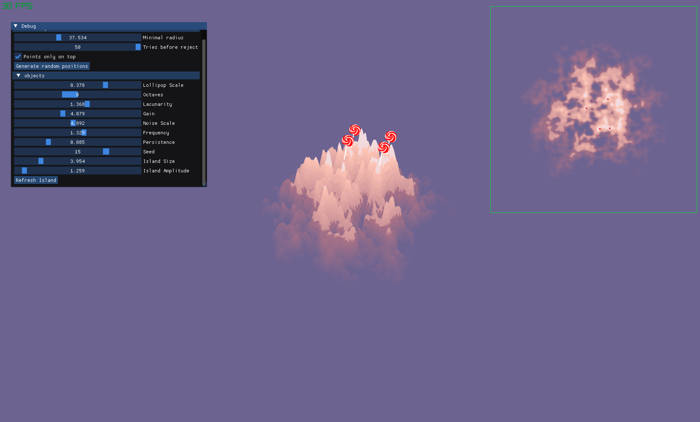

# L'île des bonbons

Laïn KOWALIK & Corentin ALBERT

## Plateforme

Nous avons tous les deux développé sur MacOs (arm64).

## Choix algorithmiques

Nous avons utilisé Perlin (par défaut) comme algorithme de génération de bruit.

Pour le masque radial, nous avons utilisé une fonction gaussienne à deux dimensions, que nous avons centrée au milieu de la heightmap pour produire une forme d'île relativement réaliste.

Pour la répartition des points, nous nous sommes basé sur une des vidéos suggérées dans le sujet : [Sebastian Lague: Procedural Object Placement](https://www.youtube.com/watch?v=7WcmyxyFO7o) et l'avons adapté pour intégrer les paramètres demandés dans le sujet (rayon minimal, essais avant rejet).

Pour le filtrage des points générés, après l'algorithme de poisson disk sampling, les points dont les coordonnées correspondent à un emplacement en dessous d'une hauteur de 0.7 (limite à laquelle l'ile devient blanche) ne sont pas gardés, simplement avec une vérification des coordonnées de chaque point.

**Comme amélioration**, nous avons importé un modèle 3D de sucette (en GLB) pour qu'elles apparaissent aux sommets de l'île pour coller aux couleurs retenues.

## Paramètres retenus

Pour l'interface, on peut contrôler tous les paramètres liés à la génération de bruit dans le cahier des charges : Octaves, Lacunarity, Gain, Scale, et la Seed de génération ( + les paramètres Frequency et Persistence).

On peut également gérer la Scale et l'Amplitude du masque radial (NOTE : l'île grandit en taille si les facteurs du masque sont baissés, et inversement).

Pour la génération des points, le rayon minimal et le nombre d'essais du poisson disk sampling sont modifiables sur l'interface. En augmentant le rayon minimal, les points sont de plus en plus écarté. En diminuant le nombre d'essais max, on voit qu'il y a de moins en moins de points, surtout quand les zones éligibles (ici les sommets de l'ile) sont petites et que le rayon minimal entre les points est grand.

## Difficultés rencontrées

La principale difficulté a été de s'adapter à la structure prédéfinie du programme et de comprendre où se situaient chacune des fonctions / outils nécessaires pour travailler, mais passée cette étape le projet s'est bien déroulé.

## Captures d'écran

## Post mortem

Le projet s'est très bien passé. Nous n'avons pas eu de gros problème à l'initialisation du projet. Notre bonne maîtrise de git nous a évité tout problème de travail en collaboration au début et au cours du projet.

Nous n'avons pas non plus eu de problème au niveau de l'organisation. Nous développions chacun sur une branche, et une fois nos fonctionnalités terminées, nous nous retrouvions pour faire un merge et corriger les conflits ensemble si besoin.

Concernant la répartition du travail, Laïn a fait l'accumulation octaves, le masque d'île et la coloration en fonction d'une valeur de hauteur (les points 1 et 2 du sujet). Corentin a fait le poisson disk sampling, le filtre des points et l'amélioration (l'import du modèle 3D).

En bref, le projet s'est très bien déroulé.
